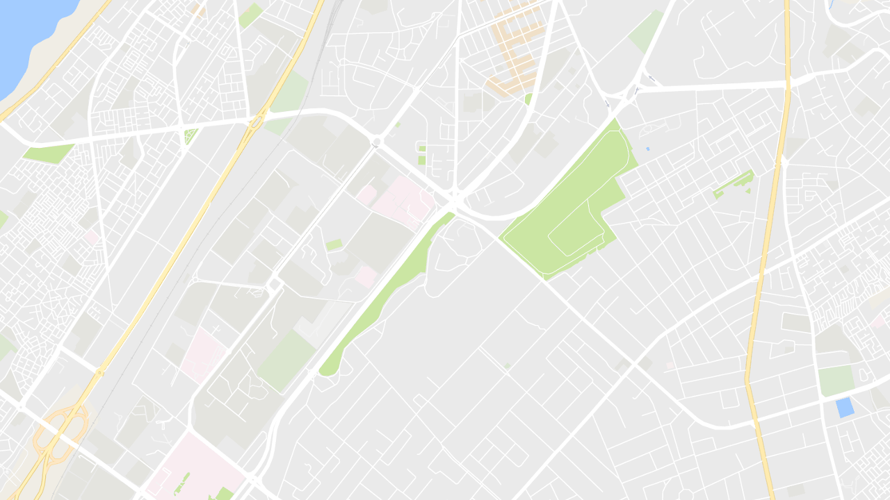

# [Guess the city](https://sirdiego.github.io/guessthecity)
This little app is inspired by the subreddit [r/guessthecity](https://reddit.com/r/guessthecity). I liked the idea and wanted it to be kinda easy to create new screenshots.

## How does it work
1. Open the page: https://sirdiego.github.io/guessthecity
1. Find your place you want the others to guess
1. Click `generate link`
1. Send the generated link to anyone you want to play with or post it to [r/guessthecity](https://reddit.com/r/guessthecity)

### Example
Look at the screenshot and guess where this is. If you have an idea open the [game](https://sirdiego.github.io/guessthecity/#v1U2FsdGVkX18cyQPk3oRw2234EO8e4GCuDILeec8LLpz0UoZYyN7S+YY0yhyQkC9IxaF+tn0dUP0R7K6yGASS+A==) and click on `Solution`
